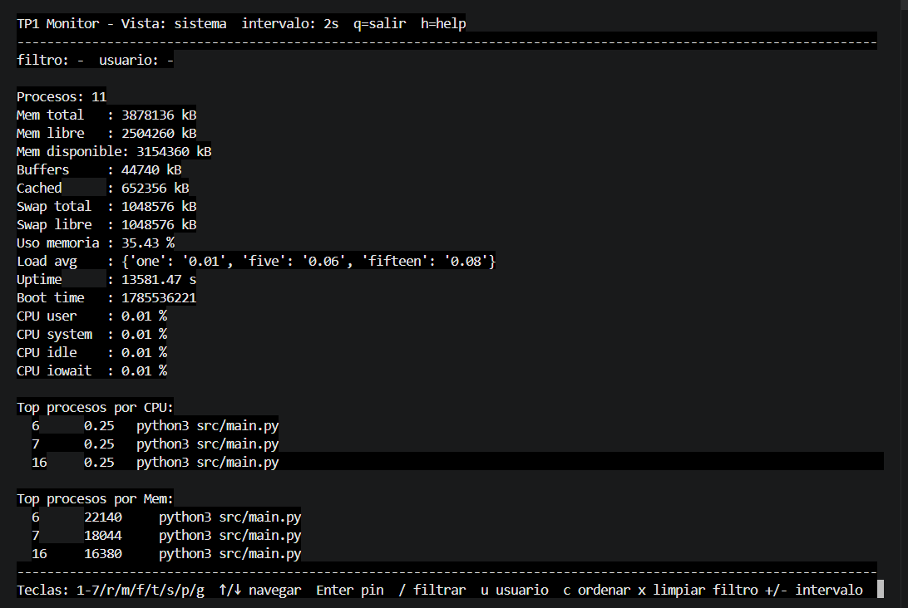
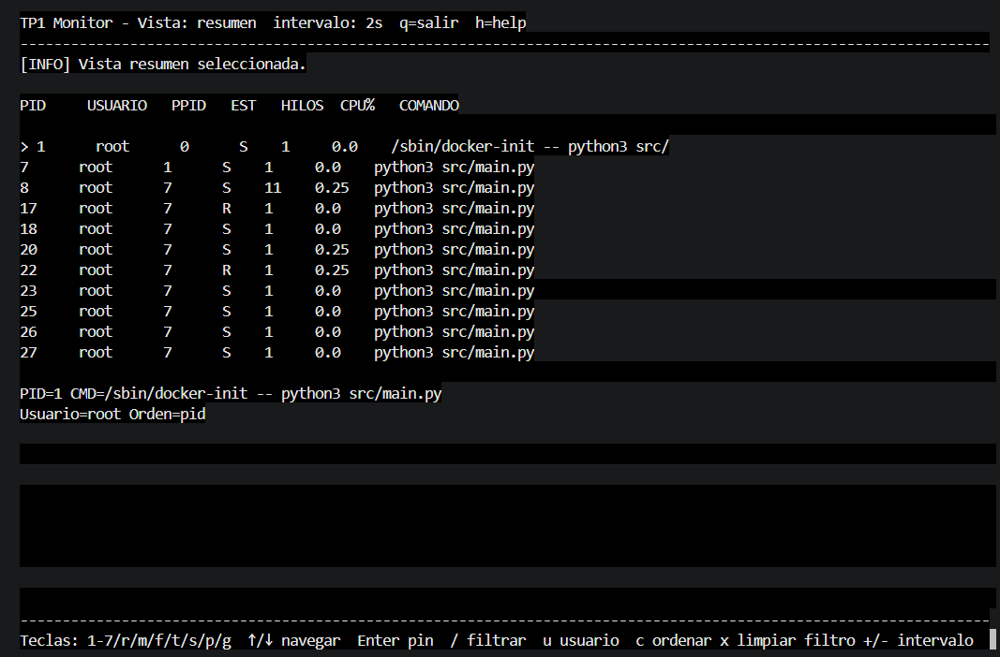
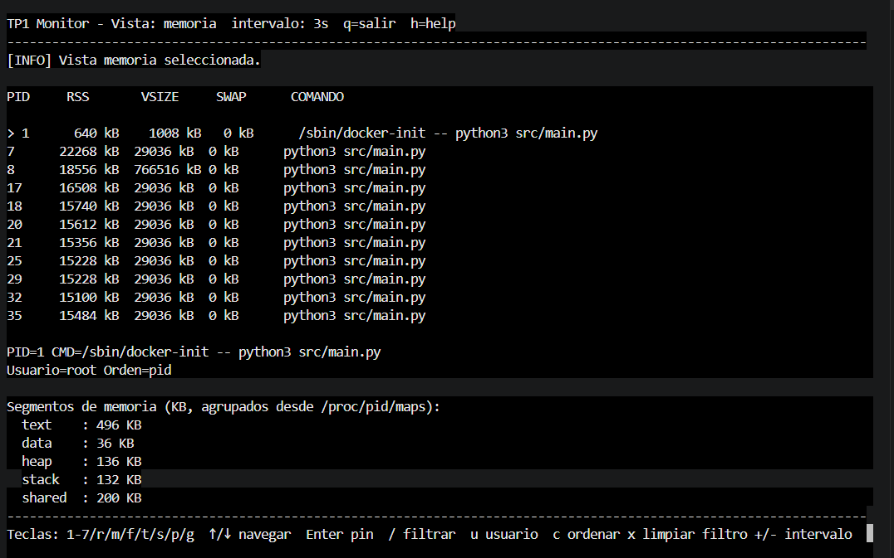
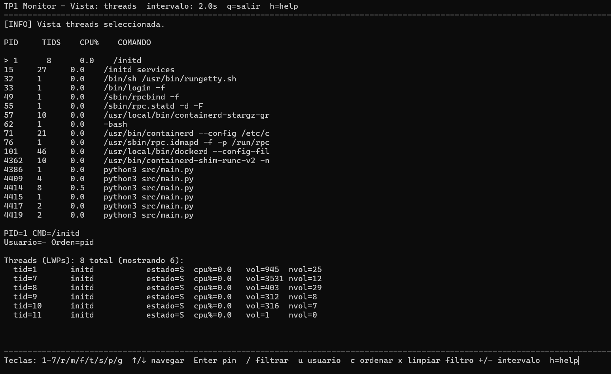
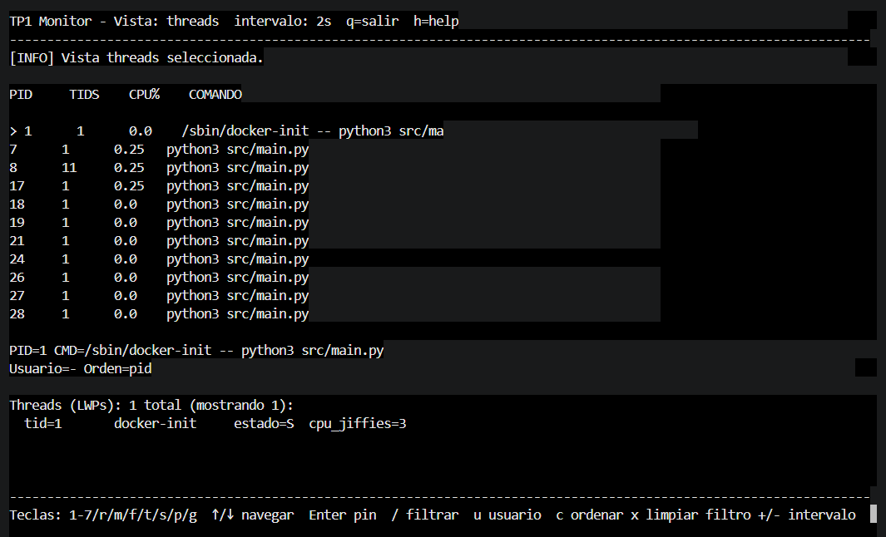
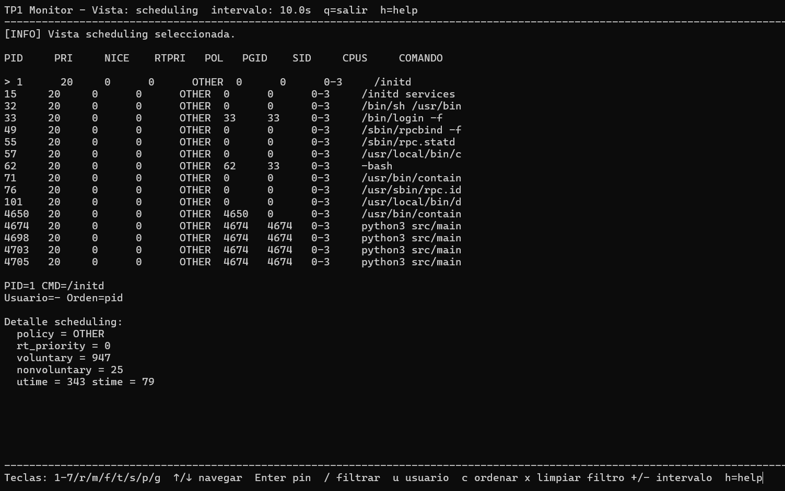
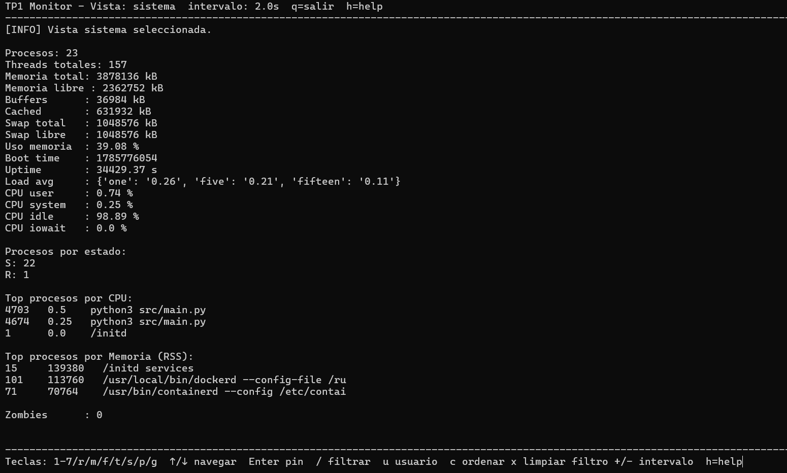
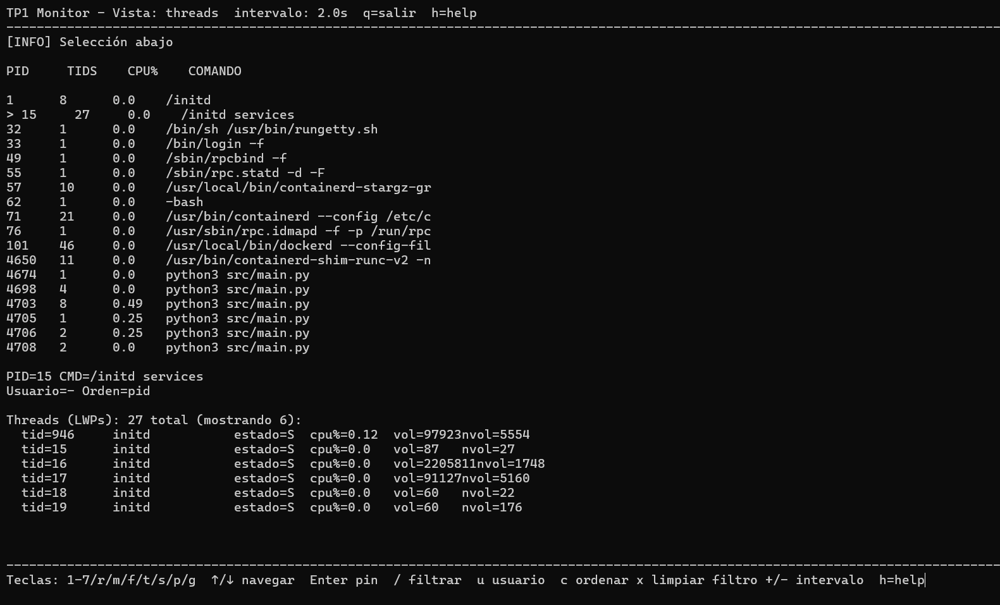

# Trabajo Práctico N° 1 - Monitor de Procesos y Threads

## Descripción general

Este proyecto implementa un monitor de procesos en Python para Linux que lee información del sistema directamente desde `/proc`, la procesa en múltiples componentes y muestra una interfaz de usuario basada en terminal.

La aplicación central funciona con:

- recolección de snapshots del sistema y procesos
- análisis independiente de vistas específicas
- un TUI interactivo con `curses`
- manejo de señales para recarga, volcado y modo verbose
- estado compartido entre procesos mediante `multiprocessing.Manager`

## Estructura del proyecto

```
TP1/
├── config.json
├── Dockerfile
├── docker-compose.yml
├── requirements.txt
├── README.md
├── src/
│   ├── main.py
│   ├── config.py
│   ├── display.py
│   ├── procfs.py
│   ├── recolector.py
│   ├── shared.py
│   ├── senales.py
│   └── analizadores/
│       ├── cpu.py
│       ├── fds.py
│       ├── memoria.py
│       ├── resumen.py
│       ├── scheduling.py
│       ├── senales.py
│       ├── sistema.py
│       └── threads.py
└── tests/
    ├── test_config.py
    ├── test_display.py
    ├── test_analizadores.py
    ├── test_procfs.py
    ├── test_recolector.py
    └── test_senales.py
```

## Archivos principales

- `src/main.py`: punto de entrada. Arranca los procesos de recolector y analizadores, y lanza la interfaz de usuario.
- `src/config.py`: carga la configuración de intervalos desde `config.json`.
- `src/procfs.py`: lee datos desde `/proc` para procesos, memoria, CPU, fds, hilos y mapas de memoria.
- `src/recolector.py`: construye el snapshot global de sistema y procesos.
- `src/shared.py`: define el estado compartido entre procesos con `Manager().dict()`.
- `src/senales.py`: gestiona señales del sistema y pipe de notificación.
- `src/display.py`: renderiza la TUI, procesa teclas y muestra las distintas vistas.
- `src/analizadores/`: contiene la lógica de cada vista del monitor.

## Vistas disponibles

El monitor soporta las siguientes vistas:

- `resumen`: procesos ordenados por CPU, con información básica de PID, usuario, PPID, estado, hilos y comando.
- `memoria`: uso de memoria RSS/VSIZE/SWAP por proceso.
- `fds`: cantidad de descriptores abiertos por proceso.
- `threads`: hilos (LWPs) por proceso.
- `senales`: máscaras de señales por proceso.
- `scheduling`: prioridad, nice, grupo de proceso y CPU permitidas.
- `sistema`: métricas globales de CPU, memoria, loadavg y top procesos por CPU.

## Controles y teclas

- `1` o `r`: vista `resumen`
- `2` o `m`: vista `memoria`
- `3` o `f`: vista `fds`
- `4` o `t`: vista `threads`
- `5` o `s`: vista `senales`
- `6` o `p`: vista `scheduling`
- `7` o `g`: vista `sistema`
- `↑` / `↓`: navegar procesos
- `Enter`: fijar o desfijar PID seleccionado
- `/`: filtrar por comando
- `u`: filtrar por usuario
- `c`: cambiar orden entre `pid`, `cpu`, `rss`
- `x`: limpiar filtros
- `+` / `-`: ajustar intervalo de actualización
- `h` o `?`: ayuda
- `q` o `Esc`: salir

## Señales soportadas

El proceso principal maneja eventos de señales para:

- `SIGUSR1`: generar dump JSON del snapshot compartido
- `SIGUSR2`: alternar modo verbose
- `SIGHUP`: recargar `config.json`
- `SIGWINCH`: detectar cambio de tamaño de terminal
- `SIGINT` / `SIGTERM`: terminar la aplicación

## Diagrama de arquitectura

Proceso y comunicación (diagrama ASCII):

```
                     +----------------+
                     |    usuario     |
                     +--------+-------+
                              |
                              v
                    +----------------------+        signals
                    |      `src/main.py`   |<--------------------+
                    +---------+------------+                     |
                              | spawn processes                       |
      +-----------------------+-----------------------+           |
      |                       |                       |           |
      v                       v                       v           |
 +-----------+    +----------------------+   +----------------+    |
 | recolector|--->| shared `Manager().dict`|<--| display (curses)|   |
 | src/recolector.py | (snapshot, intervalos)|   | src/display.py |   |
 +-----------+    +----------------------+   +----------------+    |
      |                       ^                       ^           |
      |                       |                       |           |
      |                       |                       |           |
      v                       |                       |           |
 +-----------+  +-----------+ |  +-------------+  +---+----+       |
 |analizador |  |analizador | |  |analizador   |  |analizador|      |
 | sistema   |  | resumen   | |  | memoria     |  | fds      |      |
 | src/...   |  | src/...   | |  | src/...     |  | src/...  |      |
 +-----------+  +-----------+ |  +-------------+  +---------+      |
                              |                                      |
                              +--------------------------------------+ 
```

Comunicación: los procesos comparten estado a través de `multiprocessing.Manager()` (proxy dict). Las señales (SIGHUP, SIGUSR1, SIGUSR2, SIGWINCH, SIGINT) se gestionan en `src/senales.py` para coordinar recarga, dump, verbose y resize.

## Decisiones de diseño (argumentadas)

- Mecanismo de IPC elegido
  - Se usa `multiprocessing.Manager().dict()` como estructura compartida principal (`snapshot`) entre recolector, analizadores y display. Esto permite mantener un snapshot global complejo con diccionarios y listas sin tener que serializar manualmente objetos en cada pasaje.
  - La comunicación entre recolector y analizadores usa `Queue`, y entre analizadores y agregador también usa `Queue`. De esta forma cada analizador recibe el snapshot crudo por su propia cola, y el agregador recibe solo su resultado.

- ¿Por qué `Manager` y no `Value` / `Array` para el snapshot?
  - `Value` y `Array` son útiles para datos simples y homogéneos. El snapshot global tiene estructuras heterogéneas: diccionarios anidados, listas de procesos, strings y números. Un `Manager.dict()` puede exponer esos datos directamente como proxies compartidos.
  - Para los intervalos se usa `multiprocessing.Value('d', ...)` en `src/shared.py`, porque son 7 valores numéricos simples y cambiar su valor es frecuente. Eso reduce el overhead frente a usar un proxy `Manager.dict()` aquí.

- Manejo de condiciones de carrera
  - El recolector construye el snapshot completo localmente y luego lo publica en el `Manager.dict()` de un solo golpe. Cada analizador consume la versión más reciente a través de `Queue`, y el agregador es el único proceso que escribe en el snapshot final.
  - No se muta el snapshot compartido en sitio; los analizadores leen datos del snapshot enviado por el recolector y generan resultados locales que luego el agregador vuelca en la estructura global. Esto evita inconsistencias causadas por accesos concurrentes a la misma clave.
  - Las señales se manejan con `signal.set_wakeup_fd` hacia un self-pipe, de modo que el loop principal no depende de operaciones no seguras en el handler.

- Elección de intervalos por defecto
  - Los intervalos en `config.json` son moderados (2-10s) para balancear frescura de la información y coste de I/O de `/proc`. `sistema` es rápido, por eso usa 2s; `fds` y `senales` son más costosos y usan 5-10s.
  - El usuario puede ajustar el intervalo de la vista activa con `+` / `-`, y los cambios se aplican al `Value` compartido de esa vista.

- Por qué `curses` y no `rich`
  - `curses` es parte de la stdlib de Python en Linux: no agrega una dependencia externa que pueda faltar o romperse dentro del contenedor, y encaja bien con el resto del TP.
  - Necesitaba lectura de teclado no bloqueante (`stdscr.nodelay(True)` + `stdscr.timeout(150)`) para que el mismo loop pudiera: redibujar la pantalla, revisar las flags de señales (`senales.shutdown`, `dump_requested`, etc.) y leer teclas, todo sin usar `asyncio`, ni threads extra para el input. `curses` resuelve eso con una sola llamada por vuelta de loop.

- Layout de la pantalla
  - Header fijo (vista activa, intervalo actual, mensaje de estado o filtros aplicados) + lista de procesos en el medio + panel de detalle abajo que cambia de contenido según la vista (FDs, threads, señales, segmentos de memoria o scheduling). La lista de procesos siempre está visible arriba, tal como pide la consigna, y el panel de abajo es lo único que varía.
  - El espacio de la lista se calcula dinámicamente contra el alto de la terminal (`max_lista`), reservando siempre líneas fijas para el panel de detalle y el footer de teclas, para que no se pisen aunque la terminal sea chica.

- Refresh diferenciado y no bloqueante
  - Cada vista tiene su propio intervalo (`intervalos.get(vista)`) y la pantalla solo se redibuja cuando pasó ese intervalo o hay un cambio explícito (`needs_refresh`, por ejemplo al cambiar de vista o tecla presionada). Esto evita parpadeo y consumo de CPU innecesario si el usuario no está interactuando.
  - El pin de proceso (`Enter`) se resuelve buscando el PID pineado en la lista ya ordenada/filtrada en cada redraw, así el proceso "pineado" se sigue mostrando seleccionado aunque cambie de posición al reordenar por CPU/RSS/PID.

- Modo verbose (`SIGUSR2`)
  - No agrega datos nuevos: los FDs, threads y segmentos de memoria completos siempre se leen y están disponibles, verbose solo cambia cuántas líneas se muestran en el panel de detalle (6 vs. 15), para no saturar la pantalla por default.

- Fallback sin `curses`
  - Si `curses` no está disponible o `stdout` no es un TTY (por ejemplo corriendo los tests, o en un pipe), el display cae a un loop de texto plano (`run_fallback_loop`) que igual respeta señales, filtros e intervalos. Esto también fue clave para poder testear `display.py` sin necesitar una terminal real.

## Conceptos del curso aplicados (mapeo a contenidos de clases)

- Detección de zombies (clase 3/4: procesos, fork/exec/wait)
  - Implementación: en `src/analizadores/sistema.py` se usa `stat['state']` (campo `state` devuelto por `procfs.leer_stat`) y se cuenta cuántos tienen estado `'Z'` (zombie). Esto aplica el concepto visto en clase sobre procesos terminados cuyo padre no llamó a `wait()`.

- Lectura de `/proc` y parsing de estructuras (clase 2/3: sistemas de archivos y procfs)
  - Implementación: `src/procfs.py` contiene funciones `leer_stat`, `leer_status`, `leer_cmdline`, `leer_meminfo`, `leer_loadavg`, `leer_uptime` que parsean directamente las entradas de `/proc`. Relacionado con prácticas de la carpeta `clase_2_Docker_aplicado` y `clase_3_procesos` donde se trabajó con información de procesos y entorno.

- Comunicación entre procesos y pipes/signals (clase 4/5: pipes y señales)
  - Implementación: `src/senales.py` crea un pipe para notificar el loop principal y registra handlers POSIX para `SIGUSR1`, `SIGUSR2`, `SIGHUP`, `SIGWINCH`, `SIGINT`/`SIGTERM`. Esto refleja lo visto en `clase_4_pipes` y `clase_5_señales` sobre el uso de pipes no bloqueantes y handlers para coordinar eventos.

- Multiprocesamiento y uso de `Manager` (clase 7: multiprocessing)
  - Implementación: `src/shared.py` instancia `Manager()` y expone `snapshot` e `intervalos` como proxies compartidos; `src/main.py` arranca procesos (`Process`) para recolector y analizadores. Esta decisión es análoga a los ejemplos de `clase_7_multiprocessing` donde se enseñó a compartir estado entre procesos.

- Tratamiento de E/S y redirección (clase 4 y 6)
  - Implementación: las funciones de `procfs.leer_fds` y lectura de maps hacen uso de enlaces simbólicos y lectura de ficheros para inferir tipo de destino (socket, pipe, tty). Esto conecta con las prácticas de `clase_4_pipes` y `clase_6_mmap` donde se manipuló I/O y mapeos de memoria.

## Configuración

El archivo `config.json` define el intervalo de actualización para cada vista:

```json
{
  "resumen": 2,
  "memoria": 3,
  "fds": 5,
  "threads": 2,
  "senales": 10,
  "scheduling": 10,
  "sistema": 2
}
```

## Requisitos

- Python 3.11+ (o Python 3.12 compatible)
- Linux con `/proc` disponible
- `curses` en el entorno para la interfaz TUI

## Instalación

```bash
cd TP1
```

## Ejecución local

```bash
cd TP1
python3 src/main.py
```

## Ejecución en Docker

```bash
docker compose run --rm monitor
```

El contenedor monta el directorio actual en `/app`.

## Pruebas unitarias

El proyecto incluye una suite de pruebas para:

- carga de configuración
- lectura de `/proc`
- recolección de snapshots
- análisis de vistas
- TUI y procesamiento de teclas
- manejo de señales
- estado compartido

Ejecutar la suite completa:

```bash
cd TP1
python3 -m unittest discover -s tests -p 'test_*.py'
```

Ejecutar un archivo específico:

```bash
python3 -m unittest tests.test_display
```

## Notas

- El proyecto está pensado para Linux, ya que usa `/proc` y señales POSIX.
- En entornos sin `curses`, el proyecto tiene una ruta de fallback que imprime texto simple.
- La configuración de intervalos puede recargarse en caliente con `SIGHUP`.
- El monitor usa `multiprocessing` y `signal.set_wakeup_fd` para evitar bloquear el loop principal en la espera de señales.

## Limitaciones conocidas

- La vista de memoria no muestra todos los campos de `/proc/<pid>/status` (por ejemplo `VmData`, `VmLib`, `VmExe` se parsean pero pueden no presentarse todos en pantalla según ancho de terminal).
- El cálculo de CPU% por thread usa el delta de jiffies relativo al delta global, lo cual puede ser menos preciso en procesos muy cortos o con picos rápidos.
- La interfaz `curses` puede no renderizar bien en terminals muy pequeños; la experiencia funciona mejor con al menos 80 columnas.
- Si un analizador muere, el monitor principal no reinicia automáticamente ese proceso; el shutdown sigue funcionando.

## Lo que aprendí

Después de pasar semanas leyendo `/proc` a mano, ahora los distingo por instinto: un PID es una carpeta en `/proc`, un TID es una carpeta dentro de `task/`, y cada uno tiene su propio `stat` con su propio estado, su propio tiempo de CPU y sus propios context switches. Verlo escrito en un archivo de texto plano, en vez de leerlo en un diagrama, lo hizo mucho más real.

Lo que más me costó no fue leer `/proc` — eso, una vez que entendés el formato, es mecánico — sino diseñar la comunicación entre procesos sin terminar con una race condition. Al principio tenía la tentación de que cada analizador escribiera directo en el `Manager.dict()` del snapshot, y me di cuenta a tiempo (gracias a pensarlo en términos de "¿quién puede escribir esta clave al mismo tiempo que quién?") de que eso metía justo el problema que el TP quería que evitara. Terminar con un solo escritor (el agregador) fue la decisión que más me acomodó la cabeza: de golpe dejé de necesitar locks explícitos porque estructuralmente era imposible que dos procesos pisaran el mismo dato.

Las señales fueron la otra sorpresa. Sabía que `SIGINT` mataba procesos, pero no tenía ni idea de que escribir código "async-signal-safe" era un problema real — que no podés simplemente hacer lo que quieras dentro de un handler porque puede interrumpir cualquier cosa en cualquier momento. El patrón self-pipe con `signal.set_wakeup_fd` me resultó rarísimo la primera vez que lo vi (¿escribir a un pipe desde un handler para que el loop principal lo "note" después?), pero una vez que lo armé y vi cómo `SIGUSR1` disparaba un dump sin bloquear ni romper nada, entendí por qué se usa tanto en sistemas reales.

Si tuviera que resumir en una frase: este TP me sacó la idea de que Linux es una caja negra. `/proc` es, literalmente, el sistema operativo contándote qué está haciendo, en texto plano, todo el tiempo.

## Buenas prácticas

- Ejecuta siempre desde el directorio `TP1` para que las rutas relativas funcionen.
- Usa un terminal real para la interfaz `curses`, no un entorno no interactivo.
- Si agregas nuevas vistas, incluye tests en `tests/test_analizadores.py` y la lógica de render en `src/display.py`.

## Capturas del buen funcionamiento 







